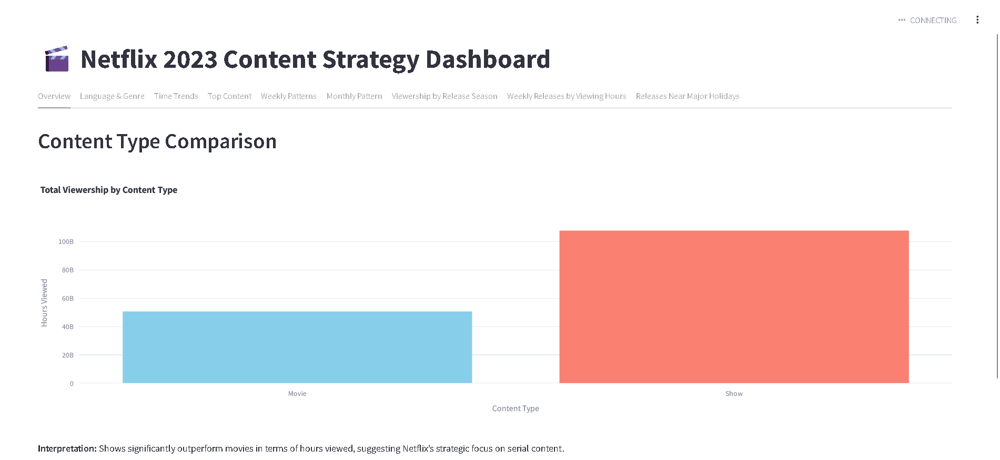

# 🎬 Netflix 2023 Content Strategy Dashboard – Streamlit App



## 📈 Project Overview

This interactive **Streamlit dashboard** analyzes and visualizes Netflix’s 2023 content release strategy based on **hours viewed, language trends, content type, and seasonal patterns**. Built as a full-stack data product by a professional **data analyst and data scientist**, this app combines storytelling, interactivity, and data-driven insights to showcase platform behavior and content strategy effectiveness.

> 💼 Ideal for hiring managers, product analysts, and data science recruiters looking for real-world storytelling with impact.

---

## 🔍 Key Features

- 📊 **Content Type Analysis**  
  Compare total hours viewed for **Shows vs Movies**, revealing where Netflix is truly winning attention.

- 🌍 **Language & Localization Insights**  
  Uncover global audience trends—English dominates, but Korean and non-English content is on the rise.

- 🕒 **Time-Based Trends**  
  Explore viewership across **months, days of the week, and seasons**, visualized beautifully with **Plotly**.

- 🏆 **Top-Performing Titles**  
  Drill into the highest-performing shows and movies, including language and release timing context.

- 🎯 **Strategic Timing Patterns**  
  Analyze weekly releases vs engagement, monthly surges, and holiday-linked releases to reveal **launch playbooks**.

- 📁 **Clean Modular Tabs**  
  9 fully structured Streamlit tabs with legends, tooltips, and responsive layout.

---

## 📸 Screenshots

### 🧭 Dashboard Navigation Tabs


### 📊 Viewership by Content Type


### 📅 Monthly Trends with Plotly


### 🎯 Holiday Release Strategy


---

## 🛠 Built With

- **Python 3.9+**
- **Streamlit** – Web app framework for data science
- **Pandas** – Data wrangling and transformation
- **Plotly** – Interactive charting
- **Jupyter / CSV** – For local exploration and model support

---

## 📁 How to Run Locally

```bash
git clone https://github.com/yourusername/netflix-strategy-dashboard.git
cd netflix-strategy-dashboard
pip install -r requirements.txt
streamlit run main.py
